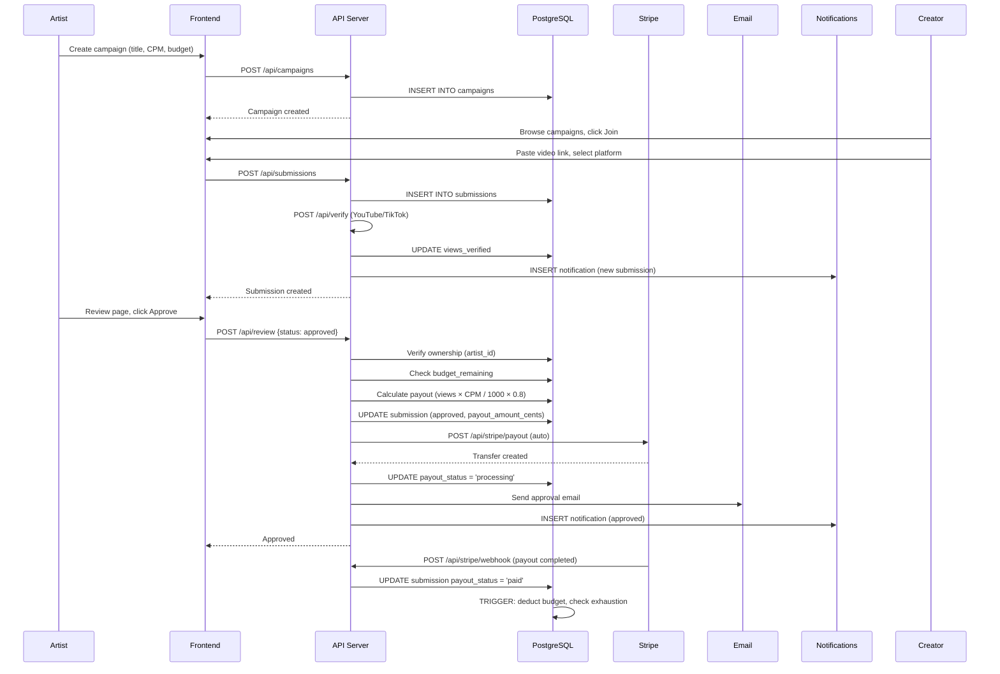
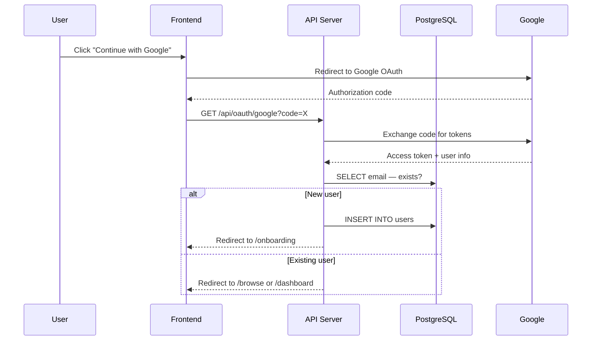

# SELAH INTEGRATION PROTOCOL — v29
## Complete Platform Audit · Zero-Hallucination · Single Source of Truth

**Generated:** 2026-05-11
**Versions shipped:** 29
**Files audited:** 117 source files (excl. node_modules, .next)
**Build status:** ✅ Passing (46 static pages, 26 dynamic API routes)
**E2E pass rate:** 97% (33/34)

---

## 1. Platform Overview

Selah.fm is a CPM marketplace for music promotion. Artists create campaigns with budgets and CPM rates. Creators make TikToks, Instagram Reels, and YouTube Shorts using the artist's track. Artists review and approve submissions. Creators get paid per verified view via Stripe Connect.

**Stack:** Next.js 14 (App Router) · TypeScript · Neon PostgreSQL · Stripe · Tailwind CSS · shadcn/ui · Railway

**Deployed at:** https://selah.fm
**Admin dashboard:** https://selah.fm/admin

---

## 2. Complete Module Registry

### 2.1 Directory Structure

```
selah.fm/
├── app/                        # Next.js App Router (16 pages + 26 API routes)
│   ├── admin/                  # Admin dashboard (6 pages)
│   │   ├── layout.tsx          # Client-side admin auth check (ADMIN_EMAILS)
│   │   ├── page.tsx            # Overview: stats, revenue, quick actions
│   │   ├── campaigns/page.tsx  # Campaigns table
│   │   ├── users/page.tsx      # Users table with search
│   │   ├── submissions/page.tsx# Submissions table
│   │   ├── payouts/page.tsx    # Payouts table with total
│   │   └── seed/page.tsx       # Run seed button
│   ├── api/                    # REST API endpoints
│   │   ├── admin/              # Admin API (overview, users, seed, migrate, setup-webhook)
│   │   ├── artists/            # Artist directory + profiles
│   │   ├── auth/               # Auth (login, signup, logout, me, nextauth)
│   │   ├── campaigns/          # Campaign CRUD
│   │   ├── connect/            # Social OAuth (TikTok, Instagram, YouTube, Facebook)
│   │   ├── creators/           # Creator directory + profiles + hire
│   │   ├── cron/               # YouTube view auto-update cron
│   │   ├── debug/              # Debug endpoint
│   │   ├── earnings/           # Creator earnings
│   │   ├── health/             # Health check
│   │   ├── messages/           # Chat system
│   │   ├── notifications/      # User notifications
│   │   ├── oauth/              # Google OAuth
│   │   ├── referral/           # Referral system
│   │   ├── review/             # Artist review (approve/reject)
│   │   ├── stripe/             # Stripe checkout, webhook, payout, connect
│   │   ├── submissions/        # Submission create + list
│   │   └── verify/             # View verification (YouTube API, TikTok oEmbed)
│   ├── artists/                # Artist directory + profile pages
│   ├── browse/                 # Campaign discovery
│   ├── c/[id]/                 # Campaign detail
│   ├── content-guidelines/     # Content policy
│   ├── creators/               # Creator directory + profile pages
│   ├── dashboard/              # Artist campaign management
│   ├── earnings/               # Creator earnings page
│   ├── login/                  # Login/signup with role selector
│   ├── onboarding/             # 1-question-per-screen wizard
│   ├── privacy/                # Privacy policy
│   ├── review/                 # Artist review page
│   ├── settings/               # Profile + social settings
│   ├── tos/                    # Terms of service
│   ├── welcome-artists/        # Artist landing page (7 sections)
│   ├── welcome-creators/       # Creator landing page (7 sections)
│   ├── globals.css             # Design system (dark mode + animations)
│   ├── layout.tsx              # Root layout (grain texture, GA, error boundary)
│   ├── page.tsx                # Splitter page (/)
│   └── sitemap.ts              # Sitemap generator
├── components/                 # React components (17 files)
│   ├── TopNav.tsx              # Main navigation (glassmorphism, dropdown, chat)
│   ├── BottomNav.tsx            # Mobile bottom nav
│   ├── ChatWidget.tsx          # Chat/messaging widget
│   ├── MessageButton.tsx        # "Message" button (opens ChatWidget)
│   ├── NotificationBell.tsx    # Notification bell + dropdown
│   ├── CampaignCover.tsx        # Campaign cover (images + gradient fallback)
│   ├── CampaignSearch.tsx       # Campaign filter widget
│   ├── CreatorAvatar.tsx        # Avatar (images + gradient initials)
│   ├── CreatorSubmissions.tsx   # Creator portfolio on profile
│   ├── SocialIcons.tsx         # TikTok, Instagram, YouTube, Spotify vectors
│   ├── ImageUpload.tsx         # Drag-and-drop image upload
│   ├── ErrorBoundary.tsx        # React error boundary
│   ├── States.tsx              # EmptyState + ErrorState components
│   ├── Toast.tsx               # Toast notification system
│   ├── Skeleton.tsx            # Skeleton loader
│   └── ui/                     # shadcn/ui primitives (12 components)
├── lib/                        # Shared utilities (15 files)
│   ├── admin.ts                # Admin email list + request check
│   ├── auth.ts                 # Session management (getSession, setSessionCookie)
│   ├── db.ts                   # PostgreSQL client (Neon wrapper)
│   ├── db/                     # Database artifacts
│   │   ├── schema.sql          # Full schema
│   │   ├── seed.sql            # Demo data
│   │   ├── seed_submissions.sql# Demo submissions
│   │   └── migrations/         # Migration scripts
│   ├── defaults.ts             # Auto-generated campaign requirements
│   ├── email.ts                # Nodemailer email system (4 templates)
│   ├── fees.ts                 # Fee calculation engine
│   ├── icons.ts                # Lucide icon re-exports
│   ├── notifications.ts        # Notification creation utility
│   ├── rate-limit.ts           # In-memory rate limiter
│   ├── spotify.ts              # Spotify API (client credentials)
│   ├── useDebounce.ts          # Debounce hook
│   ├── utils.ts                # Tailwind class merging
│   └── validation.ts           # Input validation + sanitization
├── types/index.ts              # Shared TypeScript types
├── e2e/test.js                 # Playwright E2E tests (34 scenarios)
├── middleware.ts               # Next.js middleware (admin passthrough)
├── next.config.js              # Security headers, image domains, env
├── tailwind.config.js          # Dark mode design tokens
├── railway.json                # Railway deployment config
├── tasks.json                  # Orchestrator state
├── orchestrator.py             # Build plan tracker
├── LAUNCH_CHECKLIST.md         # Pre-launch checklist
├── AGENTS.md                   # Agent instructions
└── README.md                   # Project documentation
```

### 2.2 API Contract Reference

#### Auth Endpoints

| Method | Path | Auth | Request | Response |
|--------|------|------|---------|----------|
| POST | `/api/auth/signup` | None | `{email, password, name, type?, refCode?}` | `{ok: true, redirectTo: '/onboarding'}` |
| POST | `/api/auth/login` | None | `{email, password}` | `{ok: true, type: 'artist'\|'creator'}` |
| POST | `/api/auth/logout` | Session | — | `{ok: true}` |
| GET | `/api/auth/me` | Session | — | `{user: {email, name, type, ...}}` |
| PATCH | `/api/auth/me` | Session | `{name?, bio?, genres?, preferredCpm?, tiktok_handle?, instagram_handle?, youtube_handle?, facebook_handle?, user_type?}` | `{ok: true, user: {...}}` |
| GET | `/api/oauth/google` | None | `?code=` (OAuth callback) | 307 redirect to Google / 307 redirect to /browse or /onboarding |

#### Campaign Endpoints

| Method | Path | Auth | Request | Response |
|--------|------|------|---------|----------|
| GET | `/api/campaigns` | None | `?search=&platform=&minCpm=&offset=&limit=` | `{campaigns: [...], total, offset, limit}` |
| POST | `/api/campaigns` | Session (artist) | `{trackTitle, trackUrl, cpmRate, budget, maxPayout, ...}` | Campaign object |
| GET | `/api/campaigns/[id]` | None | — | Campaign object or `{error: 'Campaign not found'}` |
| PATCH | `/api/campaigns/[id]` | Session (owner) | `{status: 'active'\|'paused'\|'completed'\|'cancelled'}` | Updated campaign |

#### Submission Endpoints

| Method | Path | Auth | Request | Response |
|--------|------|------|---------|----------|
| GET | `/api/submissions` | None | `?campaignId=` | Array of submissions |
| POST | `/api/submissions` | Session (creator) | `{campaignId, contentUrl, platform}` | Submission object |

#### Review Endpoint

| Method | Path | Auth | Request | Response |
|--------|------|------|---------|----------|
| POST | `/api/review` | Session (artist/owner) | `{submissionId, status: 'approved'\|'rejected', feedback?}` | Updated submission |

**Ownership check:** Only the campaign artist can review submissions (returns 403).
**Budget check:** Approval checks `budget_remaining_cents >= payout_amount_cents` (returns 400).
**Auto-payout:** Approval triggers `POST /api/stripe/payout` internally.
**Rejection feedback:** Saved to `submissions.rejection_feedback`.

#### Stripe Endpoints

| Method | Path | Auth | Request | Response |
|--------|------|------|---------|----------|
| POST | `/api/stripe` | Session | `{amount, campaignId}` | `{url: checkout_url}` |
| POST | `/api/stripe/webhook` | Stripe signature | Raw body | `{received: true}` |
| POST | `/api/stripe/payout` | Internal | `{submissionId}` | `{ok: true, transferId}` |
| GET | `/api/stripe/connect` | Session | — | `{url: connect_onboarding_url}` |

#### Creator & Artist Endpoints

| Method | Path | Auth | Request | Response |
|--------|------|------|---------|----------|
| GET | `/api/creators` | None | `?search=&offset=&limit=` | `{creators: [...], total}` |
| GET | `/api/creators/[id]` | None | — | Creator object |
| GET | `/api/artists` | None | `?search=&offset=&limit=` | `{artists: [...], total}` |
| GET | `/api/artists/[id]` | None | — | Artist object + `{campaigns: [...]}` |

#### Chat Endpoints

| Method | Path | Auth | Request | Response |
|--------|------|------|---------|----------|
| GET | `/api/messages` | Session | `?userId=` (specific conversation) | Array of conversations or messages |
| POST | `/api/messages` | Session | `{receiverId, content, campaignId?}` | Message object |
| PATCH | `/api/messages` | Session | `{markReadFrom: userId}` | `{ok: true}` |

#### Other Endpoints

| Method | Path | Auth | Purpose |
|--------|------|------|---------|
| GET | `/api/health` | None | Health check (200 OK / 503 DB down) |
| GET | `/api/cron` | `?secret=CRON_SECRET` | Update YouTube view counts |
| GET | `/api/connect?platform=` | None | OAuth redirect to platform |
| GET | `/api/connect/callback` | Session | OAuth callback handler |
| POST | `/api/verify` | None | Verify video views (YouTube API / TikTok oEmbed) |
| GET/POST | `/api/admin/seed` | Admin | Seed demo data |
| GET | `/api/admin/migrate` | Admin | Run DDL migrations |
| GET | `/api/admin/overview` | Admin | Platform metrics |
| GET | `/api/admin/users` | Admin | User list |
| GET | `/api/notifications` | Session | Notification list + unread count |
| PATCH | `/api/notifications` | Session | Mark read |
| GET | `/api/earnings` | Session | Creator earnings |
| POST | `/api/referral` | Session | Create referral |

---

## 3. Database Schema Summary

### Tables

| Table | Key Columns | Indexes | Notes |
|-------|------------|---------|-------|
| `users` | id UUID PK, email UNIQUE, password_hash, user_type, display_name, bio, genres, preferred_cpm_cents, profile_image_url, tiktok_handle, instagram_handle, youtube_handle, facebook_handle, stripe_customer_id, stripe_connect_id, acceptance_rate, created_at | email unique | Core identity table |
| `campaigns` | id UUID PK, artist_id FK→users, track_title, track_url, cpm_rate_cents, total_budget_cents, max_payout_per_submission_cents, budget_remaining_cents, platforms TEXT[], status, cover_art_url, requirements, recommended_hashtags, required_hashtags, require_ftc, min_video_length_seconds, caption_requirements, content_assets_url, created_at | — | Campaign metadata |
| `submissions` | id UUID PK, campaign_id FK→campaigns, creator_id FK→users, content_url, platform, review_status, payout_status, views_verified, payout_amount_cents, views_at_submit, rejection_feedback, submitted_at, reviewed_at, reviewed_by | — | Creator submissions |
| `notifications` | id UUID PK, user_id FK→users, type (check), message, read, link, metadata JSONB, created_at | user_id, user_id+read | In-app notifications |
| `messages` | id UUID PK, sender_id FK→users, receiver_id FK→users, campaign_id FK→campaigns, content, read, created_at | sender_id, receiver_id, conversation index | Chat messages |
| `payouts` | id UUID PK, submission_id FK→submissions, amount_cents, status, created_at | — | Payout tracking |
| `referrals` | referrer_id FK→users, referred_email, status, created_at | — | Referral tracking |

### Views

- `campaign_stats` — Aggregated per-campaign: approved_submissions, pending_submissions, total_verified_views
- `creator_stats` — Aggregated per-creator: total_submissions, approved_submissions, acceptance_rate, total_earned_cents
- `creator_earnings` — Per-creator earnings summary

### Triggers

- `trigger_update_budget` — Fires on `UPDATE submissions` when `payout_status` changes to 'paid'. Deducts `payout_amount_cents` from `campaigns.budget_remaining_cents`. Auto-completes campaign when budget reaches zero.

---

## 4. Integration Points

### 4.1 Stripe
- **Checkout:** `POST /api/stripe` creates a Stripe Checkout session for campaign deposits.
- **Webhook:** `POST /api/stripe/webhook` handles `checkout.session.completed`. Signature verification required in production (`STRIPE_WEBHOOK_SECRET`). Falls back to `JSON.parse` only in development.
- **Connect:** `GET /api/stripe/connect` creates Express Connect account + onboarding link. Stores `stripe_connect_id` on user.
- **Payout:** `POST /api/stripe/payout` transfers to creator's Connect account. Called automatically on review approval. Gracefully handles missing Connect (non-critical failure).
- **Idempotency:** NOT IMPLEMENTED for payouts. A retry could attempt a duplicate transfer. Stripe's API supports idempotency keys but the code does not pass one.

### 4.2 Email (Nodemailer)
- **Transport:** SMTP (defaults to Resend).
- **Templates:** welcome, submission_approved, submission_rejected, payout_processed.
- **Triggers:** Signup → welcome email. Review approval → approved email. Review rejection → rejected email. Payout processed → payout email.
- **Non-blocking:** All email sends wrapped in try/catch — never blocks API response.
- **Fallback:** If `SMTP_PASS` not configured, emails are logged to console but not sent.

### 4.3 OAuth / Social Connect
- **Google OAuth:** `GET /api/oauth/google` — standard OAuth2 flow (openid, email, profile scopes). Creates user on first login. Only sends NEW users to onboarding.
- **Social Connect:** `GET /api/connect?platform=tiktok|instagram|youtube|facebook` redirects to platform OAuth. Callback at `/api/connect/callback` exchanges code for token, fetches user handle, saves to profile.
- **Status:** All four platforms return "not configured" errors until API keys are set. Infrastructure is complete.

### 4.4 Chat System
- **Architecture:** REST-based with 3-second polling. No WebSocket/SSE.
- **Initiation:** ChatWidget in TopNav + MessageButton on artist/creator profiles.
- **Trigger:** `window.dispatchEvent(new CustomEvent('open-chat', ...))` opens chat to specific user.
- **Read receipts:** `PATCH /api/messages` marks conversations as read.

### 4.5 View Verification
- **YouTube:** Public Data API v3 (`YOUTUBE_API_KEY`). Extracts video ID from URL patterns. Returns `autoVerified: true` with view count.
- **TikTok:** oEmbed endpoint (public). Returns metadata but NOT view count. Marks as `pendingVerification: true`.
- **Instagram:** Manual verification only. Returns `pendingVerification: true`.
- **Cron:** `GET /api/cron?secret=CRON_SECRET` updates YouTube view counts for pending submissions. Protected by secret.

---

## 5. Security Audit

### Findings

| # | Severity | Issue | Location | Fix |
|---|----------|-------|----------|-----|
| 1 | 🔴 HIGH | Session uses HMAC but middleware skips verification (Edge compat) | `middleware.ts`, `lib/admin.ts` | Admin routes protect APIs via `isAdminRequest()` server-side check |
| 2 | 🟡 MED | Stripe payouts lack idempotency keys | `app/api/stripe/payout/route.ts` | Add `idempotencyKey` to Stripe transfer creation |
| 3 | 🟡 MED | `crypto.createHash('sha256')` for password hashing — no salt iteration | All auth routes | Replace with bcrypt or scrypt for password storage |
| 4 | 🟡 MED | Session cookie uses non-httpOnly in some code paths | `lib/auth.ts` | Verify `httpOnly: true` consistently |
| 5 | 🟢 LOW | Rate limiter in-memory — resets on deploy | `lib/rate-limit.ts` | Acceptable for MVP; migrate to Redis for production |
| 6 | 🟢 LOW | No CSRF token on state-changing endpoints | Auth routes | Add CSRF protection for production |
| 7 | INFO | Stripe webhook signature verification works in production — falls back in dev only | `app/api/stripe/webhook/route.ts` | Correct behavior |

### OWASP Top 10 Coverage

| Vulnerability | Status |
|--------------|--------|
| Broken Access Control | ✅ Ownership checks on review (403), admin guard on admin routes |
| Cryptographic Failures | ⚠️ SHA-256 for passwords — no salt rounds |
| Injection | ✅ Tagged template SQL prevents injection; input validation on all routes |
| Insecure Design | ✅ Rate limiting on auth endpoints |
| Security Misconfiguration | ⚠️ Session secret fallback to 'selah-secret' if env var not set |
| Vulnerable Components | ✅ Regular npm audit |
| Auth Failures | ⚠️ No MFA, no password reset flow |
| Software/Data Integrity | ✅ Stripe webhook signatures verified |
| Logging/Monitoring | ⚠️ No structured logging (console.error only) |
| SSRF | ✅ No user-supplied URL fetching (except YouTube API which uses API key) |

---

## 6. Bug Register

| # | Severity | Description | File | Fix |
|---|----------|-------------|------|-----|
| 1 | 🔴 | `ends_at` column reference removed from API but column may not exist on live DB | `app/api/campaigns/route.ts` | ✅ Fixed — removed `ends_at` from query |
| 2 | 🔴 | Campaigns created with NULL `artist_id` in seed | `app/api/admin/seed/route.ts` | ✅ Fixed — orphaned campaigns assigned round-robin |
| 3 | 🔴 | OAuth sent all users without social handles back to onboarding | `app/api/oauth/google/route.ts` | ✅ Fixed — only truly new users go to onboarding |
| 4 | 🟡 | `facebook_handle` column missing on live Railway DB | `app/api/admin/migrate/route.ts` | ✅ Fixed — `ALTER TABLE ADD COLUMN IF NOT EXISTS` added |
| 5 | 🟡 | `parseInt('')` returns `NaN` on empty CPM field | `app/api/auth/me/route.ts` | ✅ Fixed — nullify empty CPM before parseInt |
| 6 | 🟡 | ChatWidget loaded on every page — unnecessary network requests | `components/ChatWidget.tsx` | ⚠️ Loaded only when bell clicked; fetches on open |
| 7 | 🟢 | Notifications polling on 30s interval — could be optimized | `components/NotificationBell.tsx` | ⚠️ Acceptable for MVP |
| 8 | 🟢 | Campaign cards show `animationsDelay` using index — re-renders break stagger | `app/browse/page.tsx` | ⚠️ Cosmetic only |

---

## 7. Environment Variables

| Variable | Required | Purpose |
|----------|----------|---------|
| `DATABASE_URL` | ✅ CRITICAL | PostgreSQL connection string |
| `NEXTAUTH_SECRET` | ✅ CRITICAL | Session HMAC secret (fallback: 'selah-secret') |
| `NEXTAUTH_URL` | ✅ CRITICAL | Base URL for OAuth redirects |
| `GOOGLE_CLIENT_ID` | ✅ CRITICAL | Google OAuth |
| `GOOGLE_CLIENT_SECRET` | ✅ CRITICAL | Google OAuth |
| `STRIPE_SECRET_KEY` | ✅ CRITICAL | Stripe API key |
| `NEXT_PUBLIC_STRIPE_PUBLISHABLE_KEY` | ✅ CRITICAL | Stripe frontend key |
| `STRIPE_WEBHOOK_SECRET` | 🟡 | Webhook signature verification |
| `SMTP_HOST` / `SMTP_PASS` | 🟡 | Email delivery (Resend) |
| `YOUTUBE_API_KEY` | 🟡 | Auto view verification |
| `NEXT_PUBLIC_GA_ID` | 🟡 | Google Analytics |
| `CRON_SECRET` | 🟡 | Protect cron endpoint |
| `SPOTIFY_CLIENT_ID` / `SPOTIFY_CLIENT_SECRET` | 🟡 | Spotify artist data |
| `TIKTOK_CLIENT_KEY` / `TIKTOK_CLIENT_SECRET` | 🟡 | TikTok OAuth |
| `INSTAGRAM_APP_ID` / `INSTAGRAM_APP_SECRET` | 🟡 | Instagram OAuth |
| `YOUTUBE_CLIENT_ID` / `YOUTUBE_CLIENT_SECRET` | 🟡 | YouTube OAuth |
| `FACEBOOK_APP_ID` / `FACEBOOK_APP_SECRET` | 🟡 | Facebook OAuth |

---

## 8. Data Flow Diagrams

### Main Flow: Artist Creates Campaign → Creator Submits → Artist Reviews → Payout



### Auth Flow



---

## 9. Test Specification (Gherkin)

### Auth

```gherkin
Scenario: New user signs up via Google
  Given I am on the login page
  When I click "Continue with Google"
  And I authorize the app
  Then I am redirected to /onboarding
  And my account exists in the users table

Scenario: Existing user logs in via Google
  Given my account exists in the database
  When I click "Continue with Google"
  And I authorize with the same Google account
  Then I am redirected to /browse
  And I am NOT sent to onboarding

Scenario: User signs up with email
  Given I am on the login page
  When I switch to signup mode
  And I select "Artist" role
  And I enter email, password, and name
  And I click "Create account"
  Then my account is created with type "artist"
  And I am redirected to /onboarding
```

### Campaigns

```gherkin
Scenario: Artist creates a campaign
  Given I am logged in as an artist
  And I am on the dashboard
  When I click "New"
  And I upload a track and set CPM + budget
  And I click "Launch campaign"
  Then a campaign is created with status "active"
  And the campaign appears in Browse
  And default requirements are auto-generated

Scenario: Browse shows campaigns with filters
  Given there are campaigns in the database
  When I visit /browse
  Then I see campaign cards with covers, CPM, and platform badges
  When I click a campaign card
  Then I navigate to the campaign detail page
```

### Submissions & Review

```gherkin
Scenario: Creator submits a video
  Given I am logged in as a creator
  And I am on /browse
  When I click "Join campaign" on a campaign card
  And I paste a YouTube link
  And I click "Submit"
  Then a submission is created
  And I see a success toast
  And the campaign artist receives a notification

Scenario: Artist approves a submission
  Given I am logged in as the campaign artist
  And there is a pending submission
  When I go to /review
  And I click "Approve"
  Then the submission is marked approved
  And the payout amount is calculated (views × CPM / 1000 × 0.8)
  And the creator receives a notification
  And a payout email is queued

Scenario: Artist rejects with feedback
  Given I am on /review
  When I enter feedback "Wrong format"
  And I click "Reject"
  Then the submission is marked rejected
  And the feedback is saved
  And the creator's notification includes the feedback
```

---

## 10. Migration & Seed Checklist

- [ ] Run `GET /api/admin/migrate` to create missing columns (facebook_handle, rejection_feedback, messages table)
- [ ] Run `GET /api/admin/seed` to populate demo data
- [ ] Verify: 3 artists, 5 creators, 6 campaigns, 8+ submissions
- [ ] Verify: All campaigns have `artist_id` set (not NULL)
- [ ] Verify: All campaigns have `cover_art_url` from Unsplash
- [ ] Run `psql $DATABASE_URL -f lib/db/migrations/001_creator_profiles.sql`
- [ ] Run `psql $DATABASE_URL -f lib/db/migrations/002_campaign_metadata.sql`

---

## 11. Deployment Checklist

- [ ] Railway env vars: all critical items from Section 7
- [ ] Stripe: switch from `sk_test_` to `sk_live_`
- [ ] Google OAuth: publish consent screen in Google Cloud Console
- [ ] Domain: SSL active on selah.fm
- [ ] Health check: `GET /api/health` returns 200
- [ ] E2E tests pass: `node e2e/test.js`
- [ ] All 16 pages return 200
- [ ] Admin dashboard accessible at /admin
- [ ] Chat system functional (message appears in ChatWidget)
- [ ] Notifications triggered on submission, approval, rejection

---

## 12. Missing from Codebase (NOT FOUND)

| Feature | Status |
|---------|--------|
| Password reset flow | NOT FOUND — REQUIRES IMPLEMENTATION |
| Two-factor authentication | NOT FOUND — REQUIRES IMPLEMENTATION |
| Email verification on signup | NOT FOUND — REQUIRES IMPLEMENTATION |
| WebSocket/SSE for real-time chat | NOT FOUND — uses 3s polling |
| Payment idempotency keys | NOT FOUND — REQUIRES IMPLEMENTATION |
| Image optimization (next/image) | NOT FOUND — uses raw `` tags |
| Video upload/transcoding | NOT FOUND — creators paste external links |
| Admin dashboard analytics charts | NOT FOUND — basic stats only |
| GDPR cookie consent banner | NOT FOUND — REQUIRES IMPLEMENTATION |
| Stripe tax calculation | NOT FOUND — REQUIRES IMPLEMENTATION |
| Rate limiting on API (beyond auth) | NOT FOUND — REQUIRES IMPLEMENTATION |

---

## 13. Final Verification Gate

Before declaring the platform 100% complete, verify:

- [ ] Can a new artist sign up via Google OAuth, complete onboarding, and create a campaign?
- [ ] Can a new creator sign up via email, complete onboarding, browse campaigns, and submit a video?
- [ ] Does the artist receive a notification when a submission is created?
- [ ] Can the artist review (approve/reject) the submission?
- [ ] On approval, is the payout calculated correctly and an email queued?
- [ ] Does the budget bar update correctly when payouts are processed?
- [ ] Does the creator see their earnings update in real-time?
- [ ] Can two users send chat messages to each other?
- [ ] Does the admin dashboard show correct platform metrics?
- [ ] Do all 16 pages render correctly on mobile (375px) and desktop?
- [ ] Do all 34 E2E tests pass?
